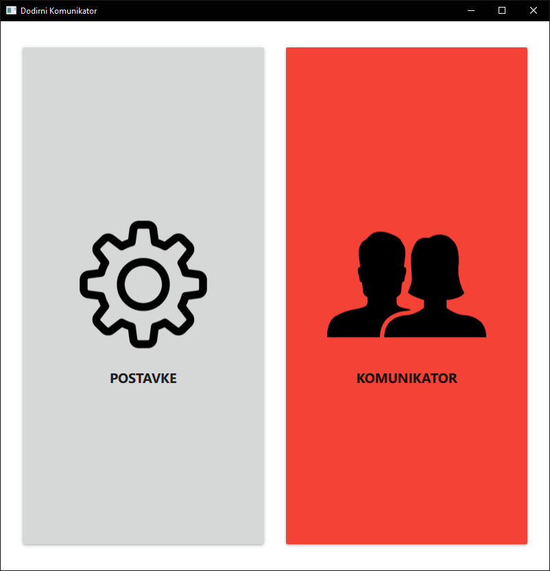
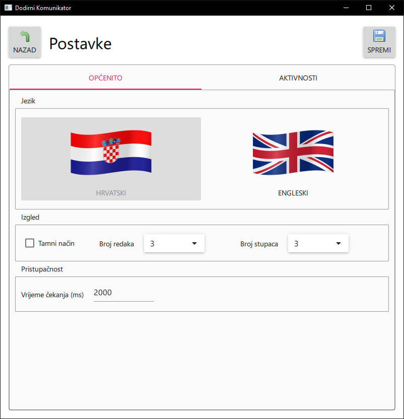
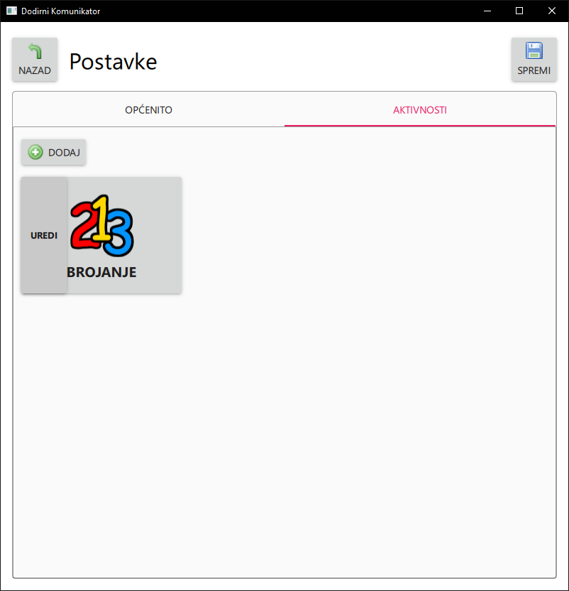
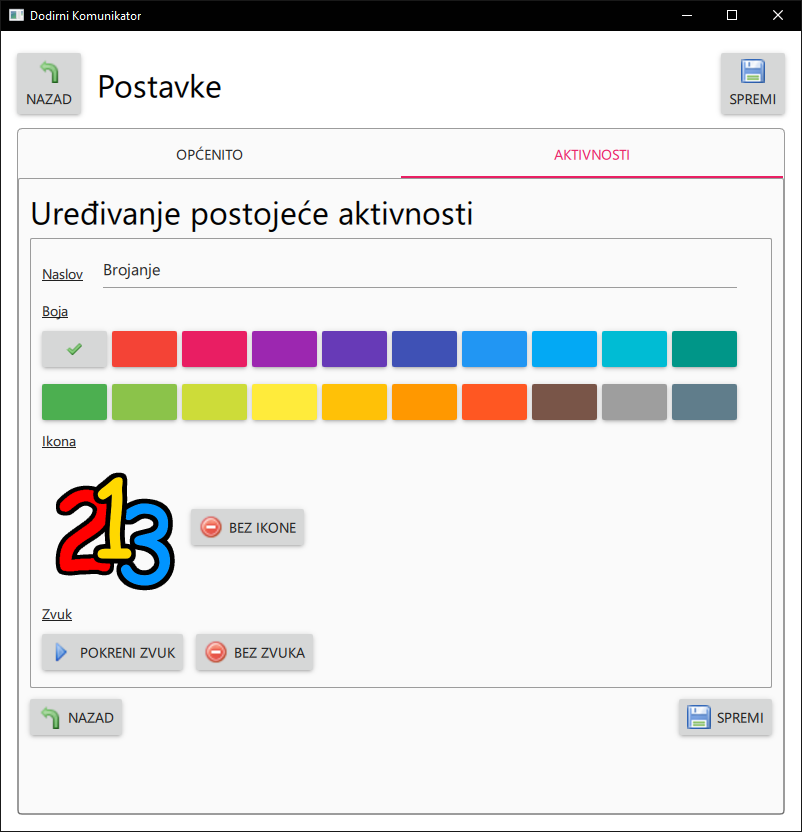
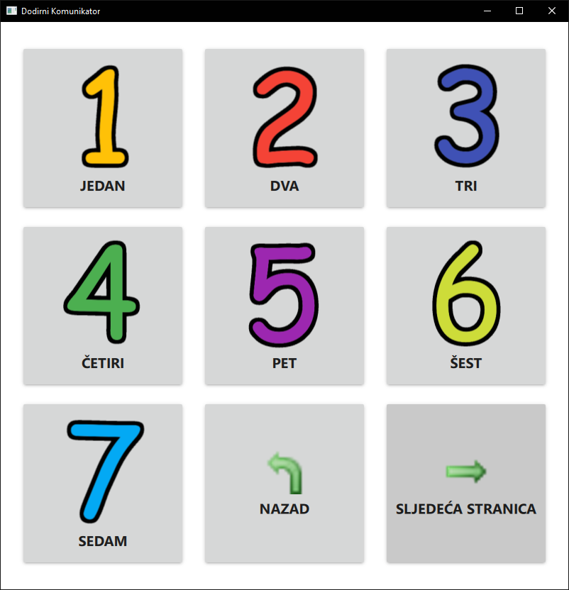

# Touch Communicator

Touch communicator written in Qt Quick (v6+).

## Toolset

This application was written with QT Creator 7.0.2 which uses Qt 6.2.3.
Therefore you will need QT Creator with QT 6 for desktop development.
Also you will need QT Multimedia which can be found in QT Maintenance Tool under Additional libraries.

## How to use

There are 2 distinct sections within the application. The settings section and the communicator section.

### Example data

For the testing purposes, on launch application prints out the location of its internal database. IT should be similar to the following:

> "C:\\Users\\Jandra\\AppData\\Roaming\\QTComm\\QML\\OfflineStorage"

Create a folder called "Databases" in that folder if it is not already created, and copy paste the "63df0d2faf505d6969a2f452d510f71d" files inside.

Alternatively you can manually enter all the data using the application, the images and sounds for the numbers are provided in the example folder.

### Settings

You should setup the desired settings and activities first, since you cannot go back to this screen once communicator is entered.

#### General settings

Available general settings:

-   Language
-   Dark mode
-   Grid size (columns \* rows)
-   Delay time

The delay time signifies for how long a button in the communicator should be held in order to trigger its action (sound + subtree traversal if it contains a subtree).

#### Activities settings

Editing activities display a similar interface to the one present in the Communicator, except with the addition of the ADD, DELETE and EDIT buttons.

It is only possible to delete activities that do not contain any sub activities (they are a leaf in a tree). Therefore if you wish to delete an activity subtree, you will have to delete all of its children first.

Every activity must contain a **TITLE**!! Optionally you can specify the button color from the available Material color pallete and upload an Icon and Action Sound.

### Communicator

> Once in this mode, you cannot leave it. If you wish to go back to the settings you will have to restart the application.

The communicator view consists of a grid (the size is specified in settings it can be either from 3x3 to 5x5).

Every button presents an activity that can contain other subactivities. If a certain activity contains more activities than there are grid slots, pagination buttons will be present. If we enter a list of subactivities return to parent button will also be present.
